# Grant Application To-Do Tree

## Working Target

Primary submission target: **January 5, 2027**

Backup submission target: **April 5, 2027**

September 5, 2026 is technically an NIH SBIR/STTR due date, but it is not the working target because company formation, federal registrations, advisor support, application writing, and review would be too compressed.

## How To Read This

- **Open now** means we can work on it before the company exists.
- **Locked** means the task depends on something else happening first.
- **Joseph** means only you can realistically do it or approve it.
- **Codex** means I can draft, research, organize, or build it with your review.
- **Advisor/Attorney** means we need outside expertise before treating the answer as final.

## Visual Dependency Tree

```mermaid
flowchart TD
  A["Grant submission: NIH/NLM SBIR Phase I<br/>Target: January 5, 2027"]

  A --> B["1. Funding path locked"]
  A --> C["2. Company exists and is registered"]
  A --> D["3. Research plan is credible"]
  A --> E["4. Team and advisors are credible"]
  A --> F["5. Prototype supports the research story"]
  A --> G["6. Budget and admin package are complete"]
  A --> H["7. Final application is assembled and submitted"]

  B --> B1["NLM fit confirmed by Dr. Reddy"]
  B --> B2["PA-27-100 selected as working NOFO"]
  B --> B3["Specific Aims revised around informatics research"]
  B --> B4["Follow-up packet sent to NLM"]

  C --> C1["Choose legal name"]
  C --> C2["Free/low-cost business guidance"]
  C --> C3["Form Texas LLC"]
  C3 --> C4["Get EIN"]
  C4 --> C5["Open business bank account"]
  C4 --> C6["SAM.gov registration and UEI"]
  C6 --> C7["eRA Commons organization account"]
  C6 --> C8["Grants.gov organization account"]
  C4 --> C9["SBA Company Registry"]
  C6 --> C10["Registration consistency audit"]
  C7 --> C10
  C8 --> C10
  C9 --> C10

  D --> D1["Specific Aims one-page draft"]
  D --> D2["Research Strategy outline"]
  D --> D3["FHIR and ClearPath JSON positioning"]
  D --> D4["Human-subjects and IRB pathway"]
  D --> D5["Security/privacy research scope"]
  D --> D6["Commercialization plan"]
  D --> D7["Phase I milestones and go/no-go criteria"]

  E --> E1["Founder/PI eligibility decision"]
  E --> E2["Technical lead plan"]
  E --> E3["Clinical workflow advisor"]
  E --> E4["Informatics/FHIR advisor"]
  E --> E5["Human-factors/usability advisor"]
  E --> E6["Privacy/security advisor"]
  E --> E7["Pilot or discovery partners"]
  E3 --> E8["Letters of support"]
  E4 --> E8
  E5 --> E8
  E6 --> E8
  E7 --> E8

  F --> F1["Provider record request workflow"]
  F --> F2["Patient approve/limit/deny workflow"]
  F --> F3["Consent-scoped package generation"]
  F --> F4["Provenance/source labels"]
  F --> F5["Audit trail"]
  F --> F6["Specific diagnosis detail under broad questionnaire items"]
  F --> F7["Body/condition view supports medical passport story"]
  F --> F8["Synthetic test scenarios"]

  G --> G1["Phase I budget"]
  G --> G2["Budget justification"]
  G --> G3["Founder salary justification"]
  G --> G4["Technical lead and consultant costs"]
  G --> G5["Facilities/resources"]
  G --> G6["Biosketch inputs"]
  G --> G7["Data management and sharing plan if required"]

  H --> H1["NOFO compliance matrix"]
  H --> H2["Draft all attachments"]
  H --> H3["Internal review"]
  H --> H4["Final PDFs and forms"]
  H --> H5["Portal validation"]
  H --> H6["Submit several business days early"]
  H --> H7["Confirm Grants.gov and eRA Commons receipt"]

  C3 -. "locks" .-> C4
  C4 -. "locks" .-> C6
  C6 -. "locks" .-> C7
  C6 -. "locks" .-> C8
  C10 -. "locks" .-> H5
  D1 -. "feeds" .-> D2
  D2 -. "feeds" .-> H2
  E8 -. "feeds" .-> H2
  F8 -. "feeds" .-> D2
  G2 -. "feeds" .-> H2
```

## Open Now

These do not require the LLC filing fee yet.

### Grant Strategy

- [x] Confirm primary funding path: NLM SBIR through `PA-27-100`.
- [x] Contact NLM program staff.
- [x] Capture Dr. Reddy's feedback.
- [x] Create NLM feedback response plan.
- [x] Create ClearPath JSON and FHIR positioning document.
- [ ] Turn Specific Aims V1 into a polished one-page aims draft.
- [ ] Build the follow-up packet for Dr. Reddy.
- [ ] Decide whether to ask Dr. Reddy about SBIR vs STTR before January submission.

### Application Writing

- [ ] Draft one-page Specific Aims.
- [ ] Draft Research Strategy outline.
- [ ] Draft Significance section.
- [ ] Draft Innovation section.
- [ ] Draft Approach section.
- [ ] Draft human-subjects/IRB decision memo.
- [ ] Draft data-management and sharing plan if required.
- [ ] Draft commercialization plan V2 using NLM framing.
- [ ] Build a NOFO compliance matrix.

### Research Design

- [ ] Define the final Phase I research question.
- [ ] Define success thresholds for each aim.
- [ ] Define participant groups and estimated sample sizes.
- [ ] Draft patient interview guide.
- [ ] Draft provider/staff interview guide.
- [ ] Draft usability testing protocol.
- [ ] Draft synthetic clinical scenarios.
- [ ] Draft analysis plan.
- [ ] Decide what requires IRB review or formal determination.

### Product And Prototype

- [ ] Prioritize the grant-critical app workflow over less critical features.
- [ ] Build provider request workflow.
- [ ] Build patient approval, partial approval, denial, expiration, and revocation workflow.
- [ ] Build consent-scoped ClearPath JSON package generation.
- [ ] Add provenance/source labels to clinical items.
- [ ] Add audit trail for request and package events.
- [ ] Add specific medical history details under broad questionnaire items.
- [ ] Keep body/condition view aligned with medical passport and diagnosis-review story.
- [ ] Create synthetic data for technical tests.

### Advisor And Partner Outreach

- [ ] Make a target list of informatics/FHIR advisors.
- [ ] Make a target list of clinical workflow advisors.
- [ ] Make a target list of human-factors/usability advisors.
- [ ] Make a target list of privacy/security advisors.
- [ ] Make a target list of clinics or healthcare organizations for discovery/pilot support.
- [ ] Draft advisor outreach email.
- [ ] Draft pilot/discovery partner outreach email.
- [ ] Draft letter-of-support template.

### Company Planning

- [ ] Choose working legal name.
- [ ] Compare final name candidates against Texas availability.
- [ ] Contact SCORE Dallas or Texas SBDC for free startup guidance.
- [ ] Look for a free or low-cost startup legal clinic.
- [ ] Make a one-page attorney/SBDC briefing packet.
- [ ] Decide Texas LLC vs another structure after free guidance.
- [ ] Save enough for the Texas LLC filing only when it does not threaten rent or necessities.

## Locked Behind Company Formation

These should wait until the company legally exists.

### Legal Entity

- [ ] File Texas LLC Certificate of Formation.
- [ ] Create basic operating agreement.
- [ ] Create company records folder.
- [ ] Assign ClearPath IP/code ownership to the company with attorney review when possible.

### IRS And Banking

- [ ] Get EIN directly from the IRS.
- [ ] Open business bank account.
- [ ] Keep business and personal funds separate.

### Federal Registrations

- [ ] Register in SAM.gov.
- [ ] Receive/activate UEI.
- [ ] Register organization in eRA Commons.
- [ ] Register organization in Grants.gov.
- [ ] Register in SBA Company Registry.
- [ ] Save SBC Control ID.
- [ ] Confirm all systems use the same legal name, address, EIN, UEI, and contacts.

### Submission Authority

- [ ] Identify Authorized Organization Representative.
- [ ] Identify Signing Official in eRA Commons.
- [ ] Confirm PI account and role.
- [ ] Confirm the PI employment requirement can be met at award.

## Locked Behind Advisors Or Partners

These need other humans involved before they are strong.

- [ ] Confirm research design with a research-methods or human-factors advisor.
- [ ] Confirm clinical workflow assumptions with at least one clinician or operations advisor.
- [ ] Confirm FHIR/standards positioning with an informatics advisor.
- [ ] Confirm privacy/security scope with counsel or security advisor.
- [ ] Obtain letters of support.
- [ ] Confirm whether any partner can support Phase I discovery sessions.
- [ ] Confirm whether any partner is interested in a Phase II pilot.

## Locked Behind NLM Feedback

These become stronger after Dr. Reddy responds to the revised aims.

- [ ] Finalize the exact aims language.
- [ ] Decide how much FHIR implementation belongs in Phase I.
- [ ] Decide whether the user study may trigger clinical-trial classification.
- [ ] Decide whether NLM recommends SBIR, STTR, or another route.
- [ ] Decide whether to add a university/research institution partner.

## Suggested Timeline To January 5, 2027

### July 2026

- [ ] Finish one-page Specific Aims.
- [ ] Build NLM follow-up packet.
- [ ] Create advisor and partner outreach lists.
- [ ] Draft outreach emails and letter templates.
- [ ] Keep improving grant-critical prototype workflows.

### August 2026

- [ ] Send follow-up aims packet if Dr. Reddy agrees.
- [ ] Start advisor outreach.
- [ ] Start clinic/discovery partner outreach.
- [ ] Draft Research Strategy sections.
- [ ] Draft human-subjects and study protocol materials.
- [ ] Continue prototype and synthetic-data work.

### September 2026

- [ ] Finalize legal name decision.
- [ ] Complete free SBDC/SCORE/legal-clinic consultation if available.
- [ ] Finalize company formation plan.
- [ ] Build budget V2 around actual Phase I aims.
- [ ] Gather biosketch/resume details.
- [ ] Request letters of support.

### October 2026

- [ ] Form Texas LLC if financially safe.
- [ ] Get EIN.
- [ ] Start SAM.gov registration and UEI.
- [ ] Start eRA Commons, Grants.gov, and SBA registrations when allowed.
- [ ] Continue drafting full application.

### November 2026

- [ ] Finish registrations.
- [ ] Resolve account or identity issues.
- [ ] Complete full application draft.
- [ ] Get advisor review.
- [ ] Collect letters and budget support.

### December 2026

- [ ] Finalize all narratives.
- [ ] Finalize budget and justification.
- [ ] Finalize forms and attachments.
- [ ] Run compliance review.
- [ ] Upload early if possible.
- [ ] Resolve Grants.gov/eRA Commons errors.

### January 2027

- [ ] Submit before January 5, 2027.
- [ ] Verify Grants.gov receipt.
- [ ] Verify eRA Commons assembled application.
- [ ] Save submitted package and receipts.

## Critical Path

The tasks most likely to control the schedule are:

1. Company formation.
2. SAM.gov/UEI activation.
3. eRA Commons setup.
4. Specific Aims finalization.
5. Advisor and partner letters.
6. Full Research Strategy draft.
7. Budget and budget justification.
8. Portal validation before submission.

If any of those slip badly, April 5, 2027 becomes the backup submission target.

## This Week's Best Next Steps

- [ ] Polish the one-page Specific Aims.
- [ ] Create the NLM follow-up packet.
- [ ] Make the free business-support outreach list.
- [ ] Create advisor outreach drafts.
- [ ] Pick 3-5 possible legal names to check.
- [ ] Continue app work on provider requests, patient approval, provenance, and package generation.
